# L4D2-FGD-Edits
This is a collection of FGD edits that can be put together to make L4D2's Hammer easier to use and more useful. 

It adds a lot of options to various entities to make them more useful.

### Contains
1. "Fade Distance" sphere helper to areaportal_window entities so you can easier pick where the fade starts and ends.
2. Ammo upgrade entities as already deployed versions.
3. New visgroups for many type of entities.
4. Default models for many props, like weapon_ammo_spawn, trigger_finale...
5. More useful melee spawner that lists all usable melee weapon names in the help box, to copypaste names. Along with a model picker to easily pick any helper model you want. Alsi has a helper model browser that's jsut there to find a custom melee model, so you can copypaste the path of the model into the helper model field. It's a bit weird, but the best setup that i can do.
6. info_survivor_position entities that allow you to pick the player model to align intro sequences.
8. Marking leftover unused entities as Obsolete with the apropriate icon.
7. A whole lot of entity fixes specific for L4D2.
8. Generic helper models for all weapon_spawn, item_spawn, upgrade_spawn. To diferentiate specific weapon spawnpoints from randomised spawns.
9. Helper meshes for env_sprites, which are balls colored in the same color sprites are colored. Furthermode, all sprites are now "World Space Glow" by default, which is what lensflare sprites usualyl always are supposed to be.
10. A bunch of new iconsprites and helper models for some often used entities, to differentiate them better. 
11. Optional color helpers for point_spotlight. unfotunately you have to **manually** set the color by copypasting the brightness value into the helper color field. If you don't, the color will default to turquoise. But this can help you remind yourself what color the light has without having to click on the entity.

Contains a VPK for hammer, including:
1. Tool textures specifically for every kind of tool brush entity. like trigger_once, trigger_hurt, info_changelevel...
2. A lot of new sprites for entities that didn't have one. Like the director and icons for all three tonemap entities.
3. various differently colored sprites for logic_relay. For people who like to color code their things.
4. L4D2 specific measure textures for doors, jump height, crouch space...

### Install
1. Download the entire "L4D2-FGD-Edits" repo folder into ```Steam\steamapps\common\Left 4 Dead 2\bin```
2. You should end up with the directory ```Steam\steamapps\common\Left 4 Dead 2\bin\L4D2-FGD-Edits```
3. In hammer click on **Tools - Options**
4. In the "Game Configuration" tab, look for the "Game Data Files" box use ONLY te left4dead2_ADDON.fgd. 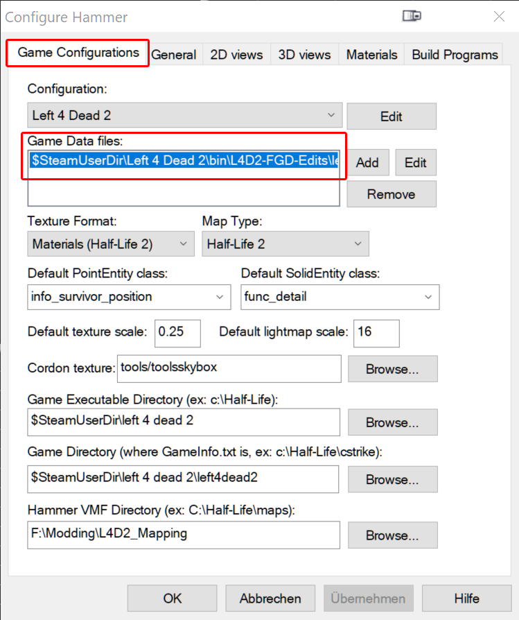
6. Open  ```Steam\steamapps\common\Left 4 Dead 2\left4dead2\Gameinfo.txt```
7. Scroll down to the first few **game** lines.
```
Game	update
Game	left4dead2_dlc3
Game	left4dead2_dlc2
Game	left4dead2_dlc1
Game	|gameinfo_path|.
Game	hl2
```

8. Add the folowing above **Game Update**

```Game	bin\L4D2-FGD-Edits\hammer_vpk```

### Images
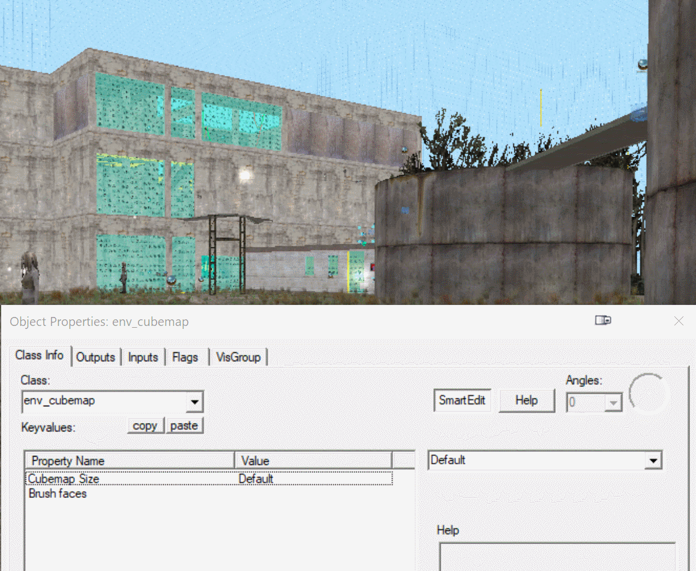
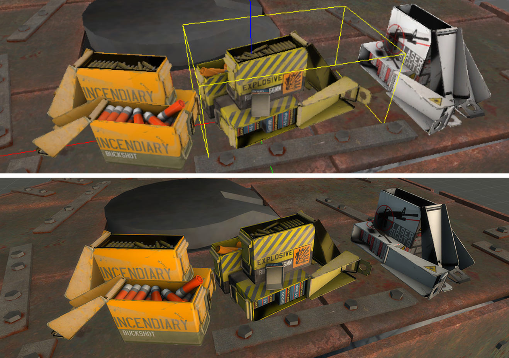
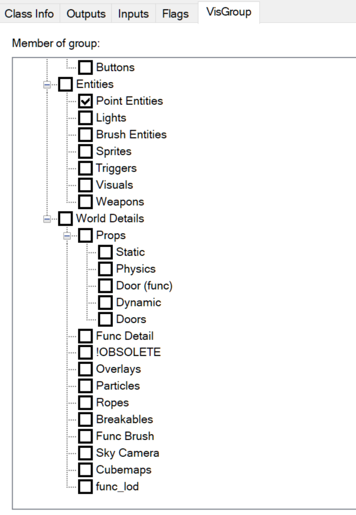
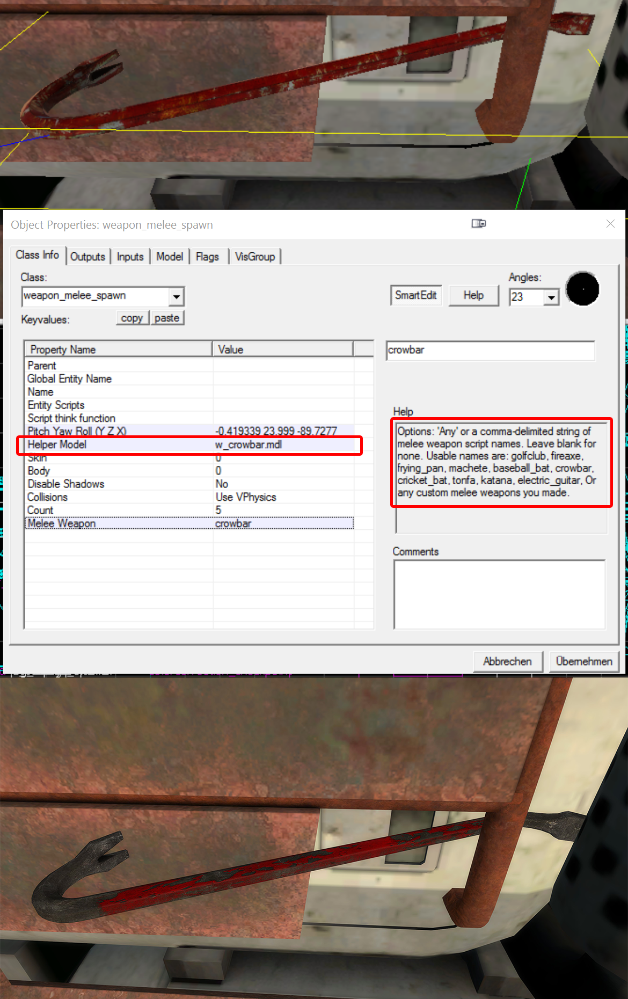
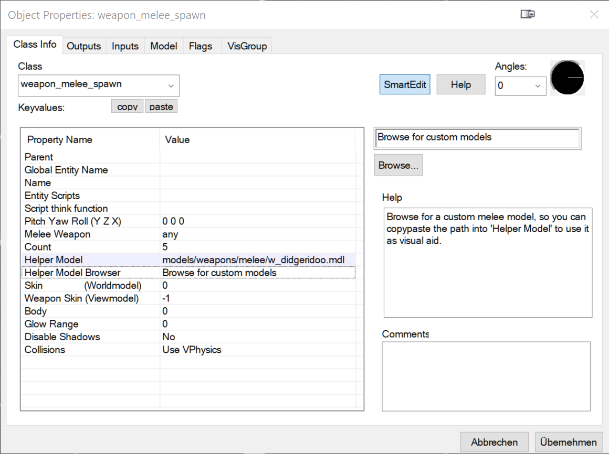
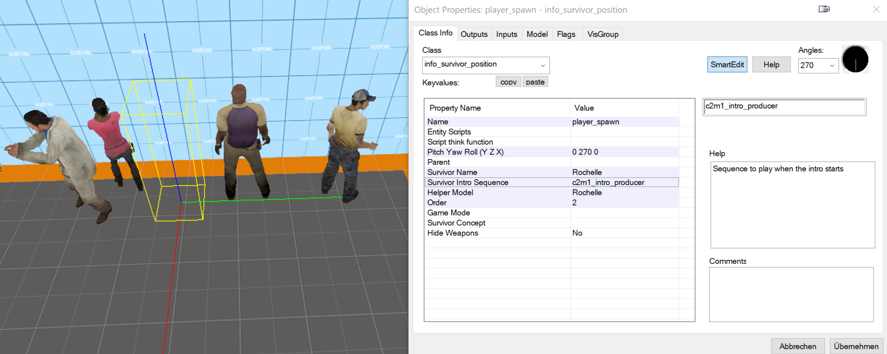
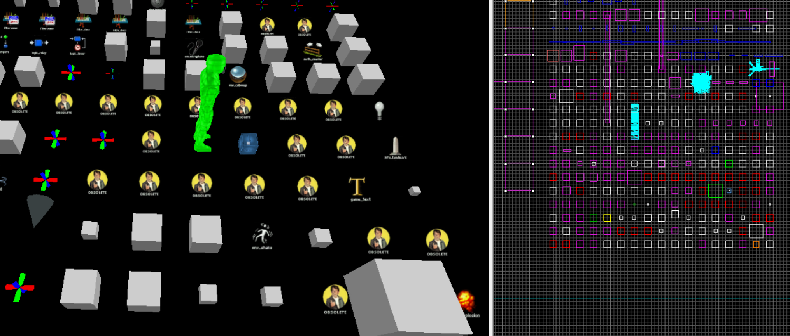
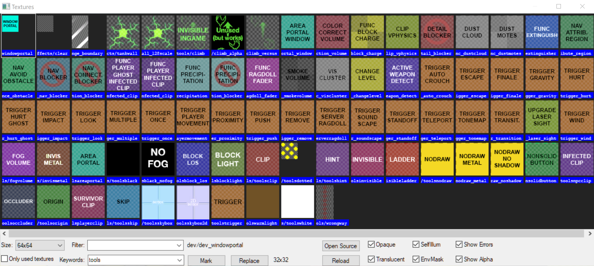
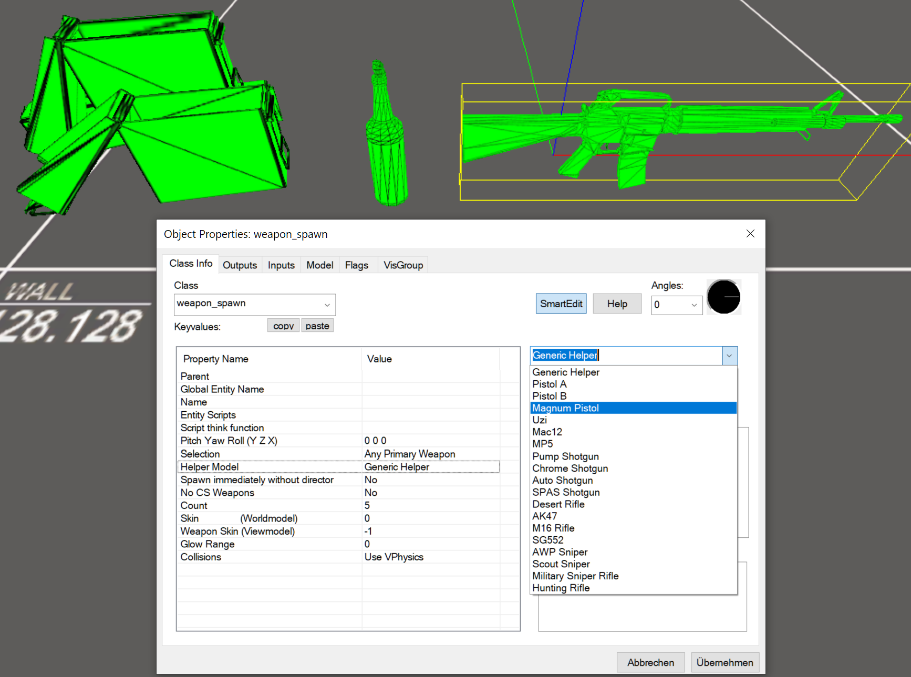
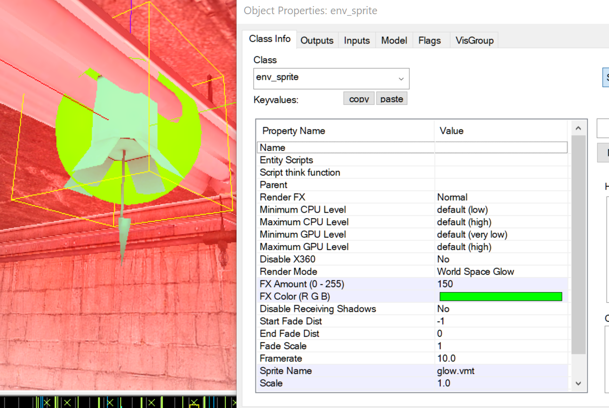
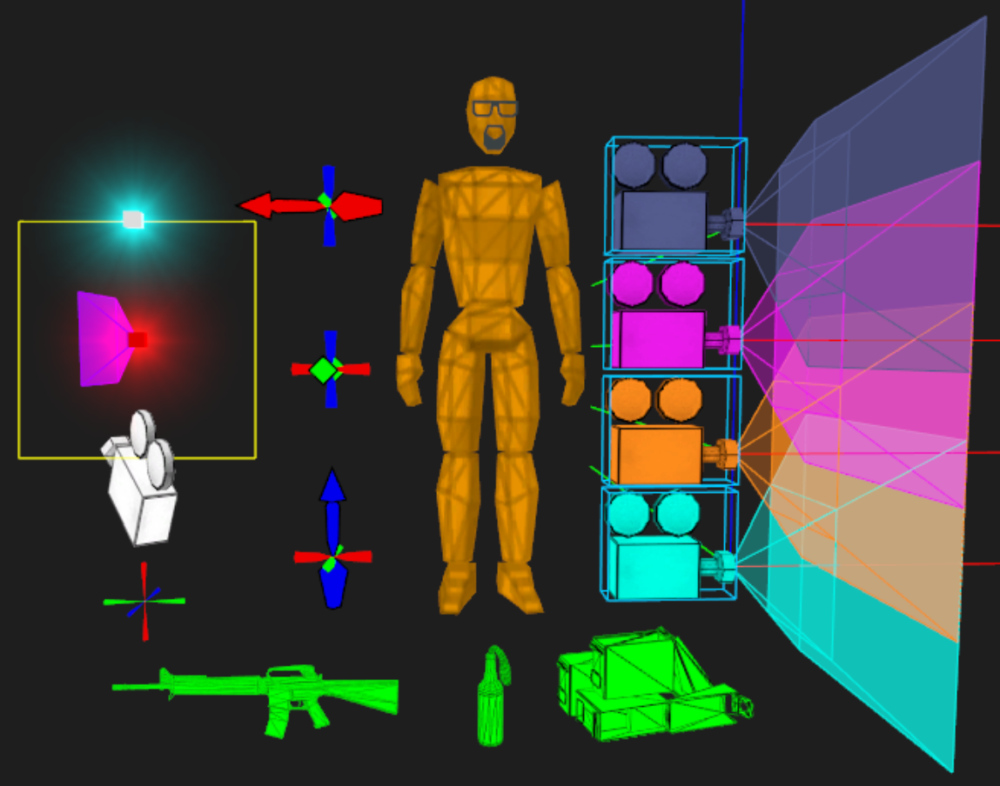
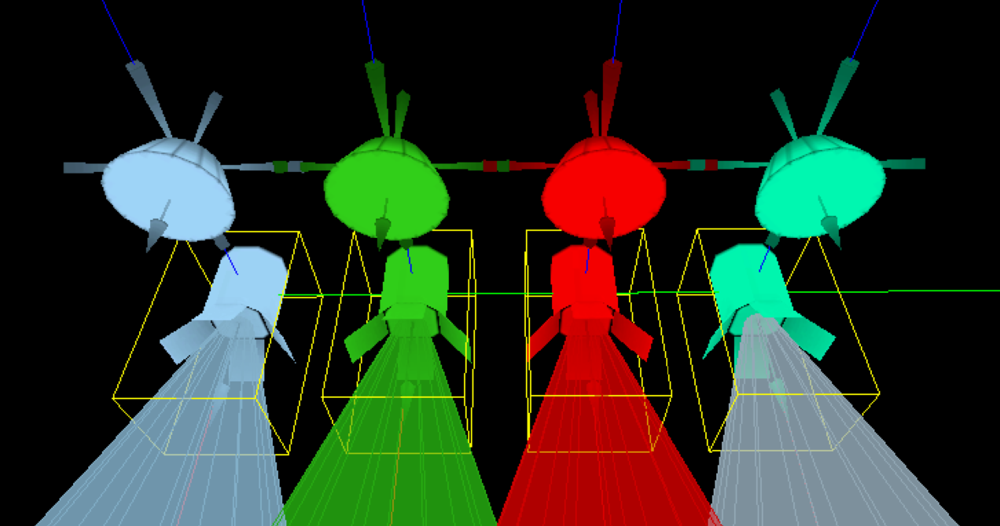
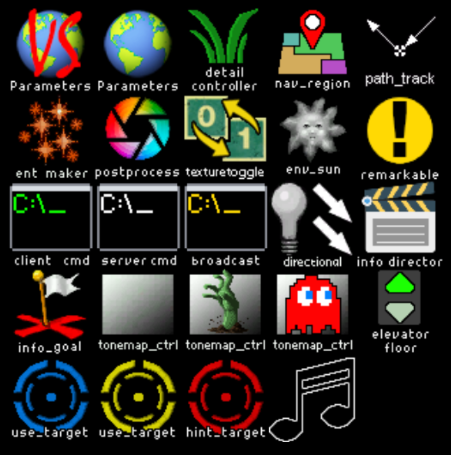
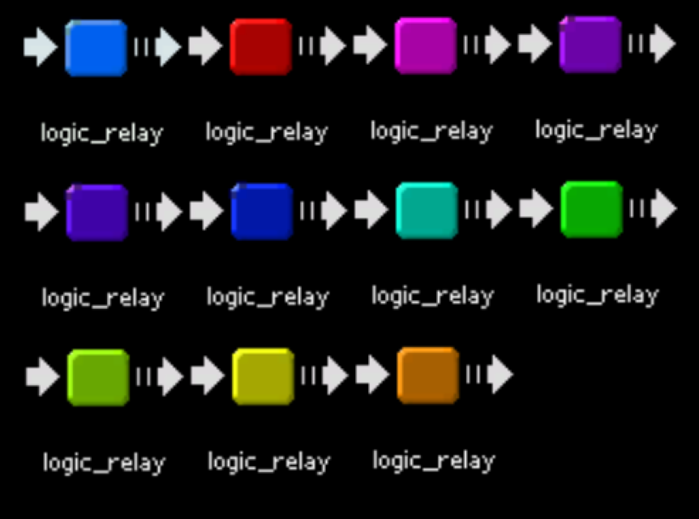


