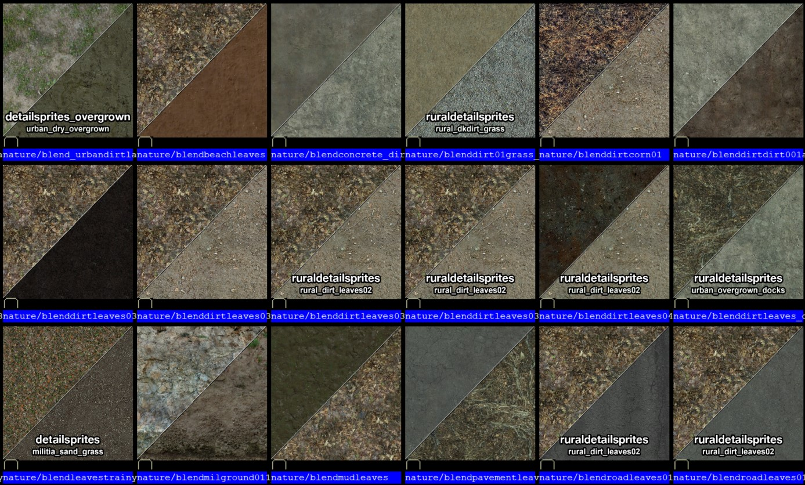
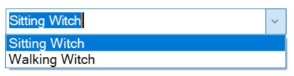
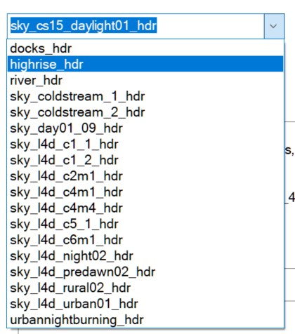
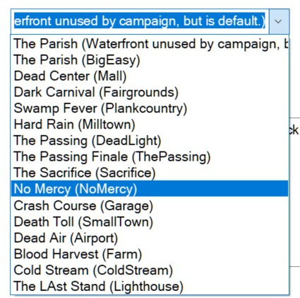
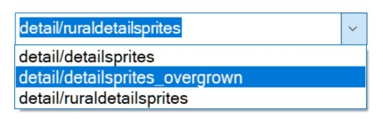
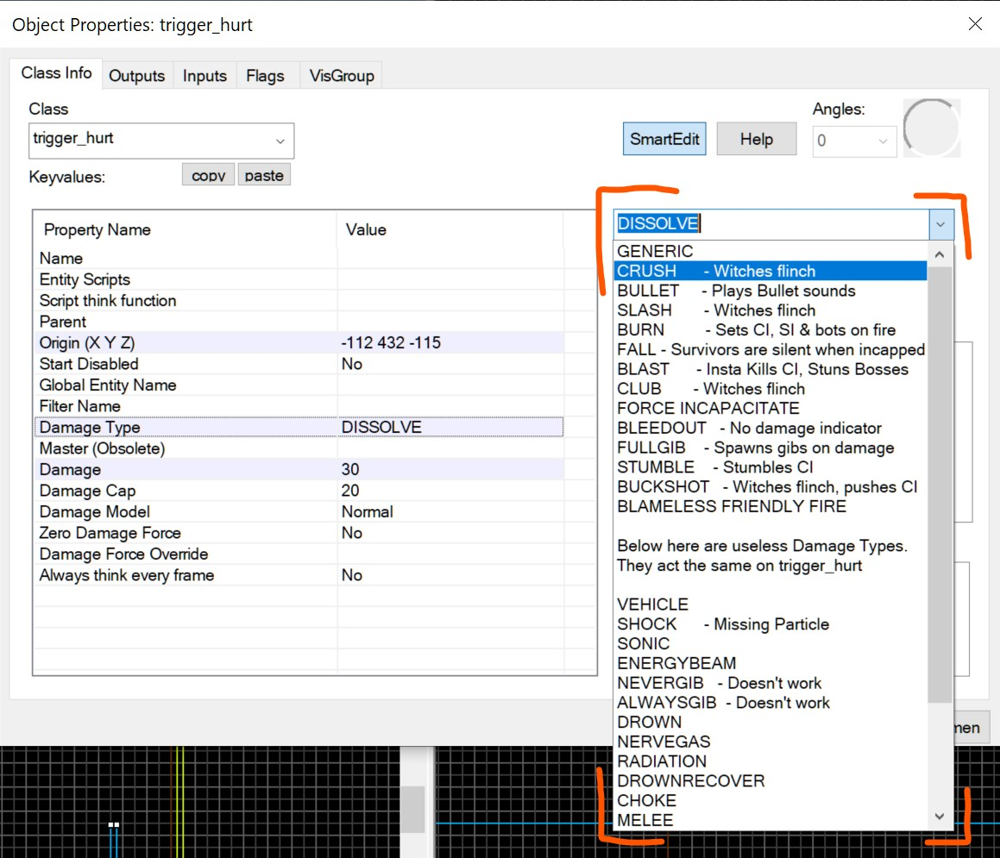
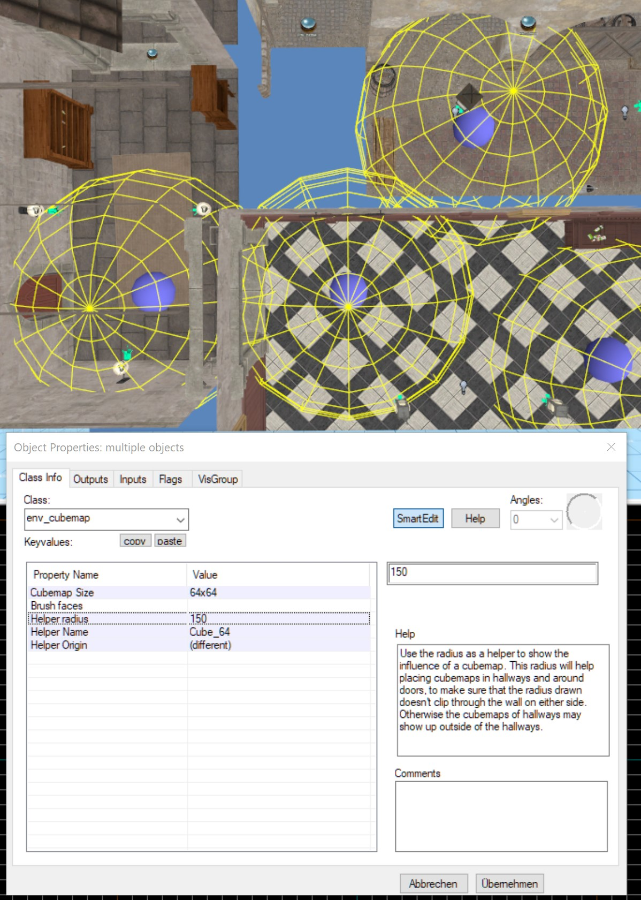

# L4D2-FGD-Edits
This set of FGD edits makes map creation for Left 4 Dead 2 a lot smoother.<br>
In L4D2's Hammer editor, some entities are missing key values, while others aren't there at all. On top of that, there's often no clear documentation explaining what these key values do.<br>
This project fixes that. I've added, documented, and tweaked all the important key values I could find, while also improving the editor with various quality-of-life changes.<br>
This is an ongoing project. I'll update this every now and then, so you should watch this repo to get update notifications.

For example, in Worldspawn, you can define things like the music track, skybox name, and how the Witch behaves (whether she's sitting or walking).<br>
But there’s no dropdown list for the music or skybox names, so you have to dig around and copy-paste the correct names. Plus, there's a "Time Of Day" setting that makes the witch wander when set to "Afternoon" because that is entirely intuitive, right?<br>

My FGD fixes all these quirks, making Hammer easier to use.<br>
I've also added new tool textures for different brush entities like func_detail_blocker and the various trigger types.<br>
it's fully compatible with Hammer++, with possible exception of the relay sprite type.<br>

⚠️ **$${\color{red}Warning:}$$**<br> 
You must change the default entity from info_survivor_position to info_player_start, or another entitiy without a model!<br>
Swapping from any entity with a model to an entity that now got a helper model -when it previously did not have one- can cause crashes.

### Install
1. Click on "Code - Download ZIP"

2. Download the entire "L4D2-FGD-Edits" repo folder into ```Steam\steamapps\common\Left 4 Dead 2\bin```

3. You should end up with the directory ```Steam\steamapps\common\Left 4 Dead 2\bin\L4D2-FGD-Edits-main```<br>
If you got a version from before May.26th.2023, you will need to delete the entire `L4D2-FGD-Edits-main` and replace it with the new one.

4. In hammer click on **Tools - Options**

5. In the "Game Configuration" tab, look for the "Game Data Files" box use **ONLY** the left4dead2_ADDON.fgd.

 
 
6. Open  ```Steam\steamapps\common\Left 4 Dead 2\left4dead2\Gameinfo.txt```


7. Scroll down to the first few **game** lines.
```
Game	update
Game	left4dead2_dlc3
Game	left4dead2_dlc2
Game	left4dead2_dlc1
Game	|gameinfo_path|.
Game	hl2
```

8. Add the folowing above **Game Update**

```Game	bin\L4D2-FGD-Edits-main\hammer_vpk```

<p>Note:</p>
Should i ever add another branch, the *L4D2-FGD-Edits-main* folder which you download might use another name. In which case you'd also need to rename this name in the gameinfo.<br>
I also made a Repo on navmesh editing, 

[you can find it here](https://www.github.com/Mrfunreal/L4D2_Navmesh_CFG "L4D2_Navmesh_CFG")

# Full documentation of the FGD Edits:

## New Base Entities
- Classname        	- Just to easily add this function to entities
- LagCompensate    	- Just to easily add this function to entities
- ThinkFunction    	- Just to easily add this function to entities
- WeaponSpawnCarry	- A base for Carryable weapons
- WarnBBox			- Adds warning about brush entity using the BBox. Meaning you're unable to use diagonal brush entities.

## New Point Entities
- hlp_origin_Vector - Just gives you the origin of where this entity is and gives you a radius option. Only useful for getting vectors for Vscripts.
- weapon_gascan         	- usually you'd have a prop_physics using the gas can model.
- weapon_gnome          	- usually you'd have a prop_physics using the gnome model.
- weapon_cola_bottles		- usually you'd have a prop_physics using the cola model.
- upgrade_laser_sight		- Spawnpoint for JUST the laser.
- upgrade_ammo_incendiary	- Already deployed Incendiary ammo.
- upgrade_ammo_explosive	- Already deployed explosive ammo.

## FGD Edits:
- Areaportals
	- Added sphere for easy setup of fade distances.
- Cubemap
	- Added origin helper, only to know location of this entity in the world. (Never move this origin. This will relocate the cubemap.)
	- Added 512x512, 1024x1024x 2048x2048 resolution.
- Damagetype
	- Properly documented existin damage types.
	- Added unused damage types.
	- Trigger_hurt, trigger_hurt_ghost, point_hurt, and filter_damage_type make use of the new damage types.
- Func_block_charge
	- Remade fgd entry to only contain parts this entity actually uses.
	- Added warning about this brush using AABB/BBOX.
- Info_game_event_proxy
	- Added all existing game events to a drop down list, so you can pick which to use.
- Navattributeregion
	- Added all usable nav attributes.
- Info_survivor_position
	- New helper model.
	- Being able to pick model, survivor name and gamemodes from a dropdown.
- Prop_physics
	- Added parentname
	- The model window has a note listing all carryable items models, to copypaste into model field.
- Prop_static_base
	- Made "disablevertexlighting" to be off by default.
- Prop_door_rotating
	- Spawns with a model of a door 
	- Made "hardware options" obsolete. L4d2 does not have this.
- Prop_door_rotating_checkpoint 
	- Same changes as prop_door_rotating
	- The model window has a note listing all saferoom doors, to copypaste into model field.
- Color_correction
	- Added tip notes and obsoleted things.
- Func_fish_pool
	- Added helper sphere to see how largethe pool is.
- Env_smoketrail
	- Added sphere for spawnradius.
- Env_physics_blocker & env_player_blocker
	- Changed size of box
- func_lod & env_fire
	- Adds classname, lagcompensate keyvalues
- logic_auto
	- Removed useless global states. L4d2 has none. 
- Trigger_finale
	- Hamradio as default radio.
- prop_car_glass & prop_car_alarm
	- Made entities use the only models they always use as default model. Way easier to setup now.
- TriggerOnce
	- Listed obsolete flags as obsolete (Applies to all triggers)
- WeaponSpawnSingle
	- Renamed WeaponSkin, to make it more obvious what it is. Applies to all weapon spawns. (Skin and Weaponskin are not the same, but you need to edit both.)
- weapon_spawn
	- Added generic weapon helper model
- weapon_ammo_spawn
	- The model window has a note listing both ammo models, to copypaste into model field.
- weapon_melee_spawn
	- Added ability to pick helper model from list.
	- Added model browser to browse for custom melee models, to copy paste into helper model field.
	- Added a note about what melee weapon names are valid
- prop_minigun_l4d1 & prop_mounted_machine_gun
	- Removed prop_dynamic as base, because none of its keyvalues affect the mounted weapons.
- Worldspawn
	- Removed obsolete keyvalues.
	- Made DetailMaterial a drop down to pick from possible detail material files.
	- TimeOfDay only affects if the witch sits or stands. So i renamed it and turned it into a drop down menu to pick Witch behaviour.
	- Turned MusicPostFix into a dropdown to pick music type.
	- Turned SkyName into a dropdown to Skybox texture.
- Visgroups
	- Added a whole lot of visgroups for various entities.
- func_nav_avoidance_obstacle
	- Added warning about this brush using AABB/BBOX.
- func_detail_blocker
	- Added warning about this brush using AABB/BBOX.

## Other edits
- Tool textures specifically for every kind of tool brush entity. like trigger_once, trigger_hurt, info_changelevel...
- Entirely new tool texture: ToolsNonsolidButton. A texture that is not solid, does not cut visleafes and is invisible. Perfect for buttons that you would need to clip through, or don't want the collision of the brush entity to be a factor. (Does not need to be shipped with the map.)
- A lot of new sprites for entities that didn't have one. Like the director and icons for all three tonemap entities.
- Various differently colored sprites for logic_relay. For people who like to color code their things.
- L4D2 specific measure textures for doors, jump height, crouch space...
- Added **alleydirt_leaves** and **urban_overgrown_docks** $detailtype, with the required **detail.vbsp**
- Added "tool" keyword to Scavengeboundary texture and TankWall texture. (use the material keywork search, not material name search.)

## New / Better Helpermodels
- Weapon_Item_Spawn 
- Info_Zombie_Spawn
- Info_Survivor_Position
- Commentary_Zombie_Spawner
- Point_Viewcontrol_Multiplayer
- Point_Viewcontrol_Survivor
- Point_Deathfall_Camera
- Info_Teleport_Destination
- Upgrade_Spawn
- Env_Steam
- Sky_Camera
- Env_Lightglow
- Point_Spotlight
- Beam_Spotlight
- Light_Spot
- Path_Track
- Move_Track

## New Sprites
- Point_Nav_Attribute_Region
- Env_Tonemap_Controller_Infected
- Env_Tonemap_Controller_Ghost
- Postprocess_Controller
- Info_Director
- Light_Directional
- Env_Sun
- Info_Map_Parameters
- Info_Map_Parameters_Versus
- Logic_Relay
- Point_Clientcommand
- Point_Servercommand
- Point_Broadcastclientcommand
- Info_Goal_Infected_Chase
- Env_Texturetoggle
- Info_Remarkable
- Env_Entity_Maker
- Ambient_Music
- Point_Script_Use_Target
- Point_Prop_Use_Target
- Info_Target_Instructor_Hint
- Env_Detail_Controller
- Path_Track
- Info_Elevator_Floor

## Marks Obsolete Entities As Such
- Func_Useableladder
- Func_Ladderendpoint
- Info_Ladder_Dismount
- Info_Node
- Info_Node_Hint
- Info_Node_Air
- Info_Node_Air_Hint
- Info_Hint
- Info_Node_Link
- Info_Node_Link_Controller
- Info_Radial_Link_Controller
- Info_Node_Climb
- Prop_Minigun
- Game_Weapon_Manager
- Game_End
- Game_Player_Equip
- Game_Player_Team
- Game_Score
- Info_Overlay_Transition
- Info_Npc_Spawn_Destination
- Npc_Template_Maker
- Env_Rotorwash_Emitter
- Gibshooter
- Game_Weapon_Manager
- Game_Score
- Point_Tesla
- Info_No_Dynamic_Shadow
- Info_Overlay_Transition
- Info_Intermission
- Info_Null
- Func_Water_Analog
- Logic_Autosave
- Logic_Active_Autosave
- Point_Angularvelocitysensor
- Point_Velocitysensor
- Func_Illusionary
- Func_Wall_Toggle
- Func_Wall
- Trigger_Autosave
- Trigger_Changelevel
- Ai_Speechfilter
- Info_Camera_Link
- Npc_Furniture
- Logic_Playerproxy
- Env_Projectedtexture
- Func_Reflective_Glass
- Npc_Puppet
- Env_Funnel
- Trigger_Standoff
- Info_Ambient_Mob_Start
- Info_Ambient_Mob_End
- Info_Ambient_Mob
- Test_Traceline
- Keyframe_Track
- Move_Keyframed
- Move_Track
- Point_Message
- Env_Zoom
- Env_Screeneffect
- Light_Dynamic
- Point_Viewcontrol


### Images
Here are images of *some* abilities that have been added or changed.
<p>Areaportal Distance Picker.</p>

<p>Already deployed upgrades.</p>

<p>More Visgroups.</p>

<p>Better Melee spawn.</p>


<p>Info_survivor_position with helper models. </p>

<p>Obsolete's unused or not programmed entities.</p>

<p>More specific tool textures.</p>

<p>Blend Textures displaying what detail they use.</p>
Doesn't work in Hammer++!

<p>Optional Generic helper models for randomized weapon spawns.</p>
<p>More helper models, each camera entity got a different color. Orange Freeman there is info_teleport_destination.</p>

<p>Light_spot entities can be colored.</p>

<p>New icon sprites.</p>


<p>Worldspawn settings.</p>




<p>Damage Types.</p>

<p>Cubemap Helpers.</p>

